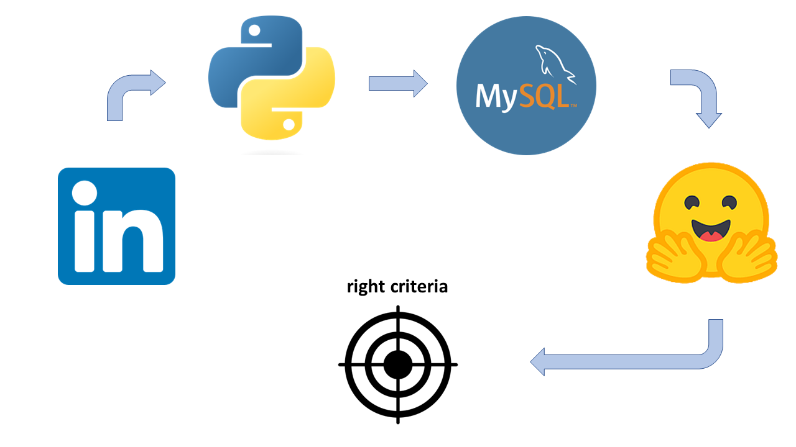
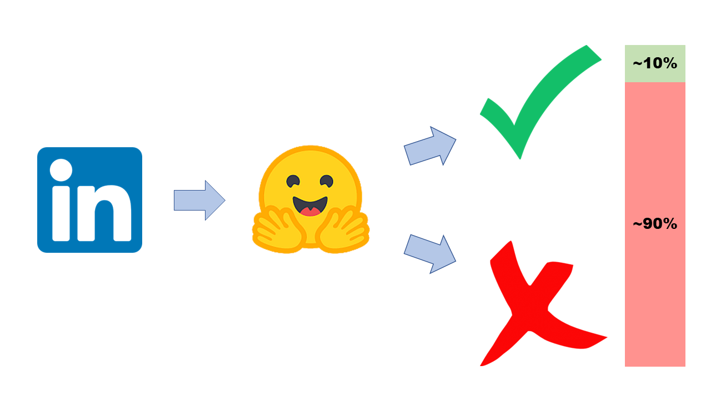

# Linkedin job filtering

## Description

Looking for a job can be a daunting task, especially when you have to sift through hundreds of job postings to find the right match. That's why I've created a Python script that automates this process for you, making it easier to find the perfect job.

The script scrapes job postings from LinkedIn, classifies them according to your job search criteria using natural language processing, and then splits the job postings into two categories: 

* jobs you're a good match for 
* jobs that are not a good fit 

The good matches are saved in a separate database, making it easy to keep track of your potential job opportunities.

The script is designed to save you time and energy, so you can focus on what matters most: finding the right job for you. Give it a try and see how it can help streamline your job search!

## How does it work?

I've been collecting and storing job data for the past few months. I gave these data certain scores depending on how much the job description fit my job search requirements. To do so, I've used <a href="https://huggingface.co/facebook/bart-large-mnli#nli-based-zero-shot-text-classification">HuggingFace's facebook/bart-large-mnli</a> and <a href="https://huggingface.co/tasks/zero-shot-classification">zero-shot-classification</a>.

Once I have these scores, I analyzed the data and set a criteria and certain tresholds for my jobs search. These tresholds are now loaded in a new script, that again uses <a href="https://huggingface.co/facebook/bart-large-mnli#nli-based-zero-shot-text-classification">HuggingFace's facebook/bart-large-mnli</a> and <a href="https://huggingface.co/tasks/zero-shot-classification">zero-shot-classification</a> to loop through the job posts on my LinkedIn job alerts and classify them in jobs I am a good match for and jobs that are not a good fit.

Finally, these jobs are stored in a database, making it easier for me to access them and allowing me to focus on finding the right job, rather than navigating through many different jobs that don't really match my profile.

## Instructions

If you're using conda, there is an environment file that you can use to create a new environment:

`conda env create -f PATH_TO_FILE/environment.yml`

You will also need a mysql installation and a LinkedIn account, with your own job alerts already set up. The usernames and passwords are stored in json documents in the <a href="https://github.com/yourssincerely/linkedin/tree/main/login">`login`</a> folder of this repo. You will need to manually update the values in these two files for the scripts to work.

You will also need to change the values in <a href="https://github.com/yourssincerely/linkedin/blob/main/4_get_jobs_and_labels.ipynb">`4_get_jobs_and_labels.ipynb`</a> when calling the function

`job_classification()` 

so that they match exactly the name of the job alerts in your personal account.

You may want to change the labels you're using for the job classification too.

## Conclusions

Thank you so much for checking out my work. Please feel free to add any comments or to hit me up on <a href="https://www.linkedin.com/in/rubentenreiro/">LinkedIn</a>!
